# Issue 016: Document Extension Dependency Direction

**Priority**: P2 — Low Impact / Low Risk  
**Phase**: 4 (Architecture)  
**Estimated Effort**: 2-3 hours  
**Confidence**: High

---

## Problem Statement

Extensions currently have no clear dependency direction. They all read `.pi/settings.json` independently and have no documented layering.

**Current state**:
- All 15 extensions are peers
- No clear "core" vs "feature" distinction
- Extensions read the same files with different implementations
- No guidance on which extensions can import from which

**Problems**:
- Risk of circular dependencies
- Hard to understand which extensions are critical vs optional
- Difficult to add new extensions without violating implicit boundaries
- No clear upgrade path (which extensions can be disabled)

**Graph analysis** shows:
- `starterKit` is a "god node" (30 edges) — tight coupling in settings
- No clear dependency direction between extensions
- 992 isolated nodes suggest missing documentation

---

## Acceptance Criteria

- [x] Define 4 extension layers (shared, core, feature, integration)
- [x] Document layers in `docs/architecture.md`
- [x] Add dependency rules to `AGENTS.md`
- [x] Categorize all 15 extensions into layers
- [x] Verify no circular dependencies with `madge` (madge unavailable locally; fallback import check found only `../shared/*` cross-extension imports)
- [x] Create dependency diagram (ASCII or Mermaid)
- [x] Document which extensions are optional

---

## Files to Modify

### Modified Files
- `docs/architecture.md` — Add extension layering section
- `AGENTS.md` — Add dependency rules
- `README.md` — Document optional vs required extensions

### New Files
- `docs/extension-layers.md` — Detailed layer documentation

---

## Implementation Approach

### 1. Define Extension Layers

```
Layer 4: Integration Extensions
  └─→ Can import from any layer
  └─→ setup-ai-memory, starter-kit-doctor, init-starter-kit

Layer 3: Feature Extensions
  └─→ Can import from Layer 1 and 2
  └─→ artifact-read, lsp-bridge, ast-tools, source-navigation, 
      auto-memory, contrib-gate, monitor-bash, rtk-rewrite

Layer 2: Core Extensions
  └─→ Can import from Layer 1
  └─→ permission-gate, post-edit-lint, loop-protection, task-tracker

Layer 1: Shared Utilities
  └─→ Can be imported by any layer
  └─→ extensions/shared/ (path-utils, settings, errors, constants)
```

### 2. Categorize Extensions

**Layer 1: Shared Utilities** (from issues 001, 002, 009, 011)
- `extensions/shared/path-utils.ts` — Path confinement
- `extensions/shared/settings.ts` — Settings loader
- `extensions/shared/errors.ts` — Error types
- `extensions/shared/constants.ts` — Magic numbers

**Layer 2: Core Extensions** (security and quality gates)
- `permission-gate` — Permission pipeline (critical for security)
- `post-edit-lint` — Post-edit linting (quality gate)
- `loop-protection` — Loop detection (quality gate)
- `task-tracker` — Task tracking (workflow)

**Layer 3: Feature Extensions** (optional features)
- `artifact-read` — Artifact inspection
- `lsp-bridge` — LSP integration
- `ast-tools` — AST search and editing
- `source-navigation` — Multi-range reads and anchors
- `auto-memory` — Auto-save memories
- `contrib-gate` — Contribution guidelines
- `monitor-bash` — Background bash monitoring
- `rtk-rewrite` — Command rewriting

**Layer 4: Integration Extensions** (setup and diagnostics)
- `setup-ai-memory` — ai-memory setup
- `starter-kit-doctor` — Environment diagnostics
- `init-starter-kit` — Project initialization

### 3. Document in architecture.md

```markdown
## Extension Architecture

Extensions are organized into 4 layers with clear dependency rules.

### Layer Diagram

```
┌─────────────────────────────────────────────────────────────┐
│ Layer 4: Integration Extensions                             │
│ setup-ai-memory, starter-kit-doctor, init-starter-kit       │
│ Can import from: Layer 1, 2, 3                              │
└─────────────────────────────────────────────────────────────┘
                              ↓
┌─────────────────────────────────────────────────────────────┐
│ Layer 3: Feature Extensions                                 │
│ artifact-read, lsp-bridge, ast-tools, source-navigation,    │
│ auto-memory, contrib-gate, monitor-bash, rtk-rewrite        │
│ Can import from: Layer 1, 2                                 │
└─────────────────────────────────────────────────────────────┘
                              ↓
┌─────────────────────────────────────────────────────────────┐
│ Layer 2: Core Extensions                                    │
│ permission-gate, post-edit-lint, loop-protection,           │
│ task-tracker                                                │
│ Can import from: Layer 1                                    │
└─────────────────────────────────────────────────────────────┘
                              ↓
┌─────────────────────────────────────────────────────────────┐
│ Layer 1: Shared Utilities                                   │
│ path-utils, settings, errors, constants                     │
│ Can be imported by: Any layer                               │
└─────────────────────────────────────────────────────────────┘
```

### Dependency Rules

1. **Layer 1 (Shared)** can be imported by any extension
2. **Layer 2 (Core)** can import from Layer 1 only
3. **Layer 3 (Feature)** can import from Layer 1 and 2
4. **Layer 4 (Integration)** can import from any layer
5. **No circular dependencies** — use `madge` to verify
6. **Same-layer imports** are discouraged (use shared utilities instead)

### Required vs Optional Extensions

**Required** (always enabled):
- `permission-gate` — Security critical
- `post-edit-lint` — Quality gate
- `loop-protection` — Quality gate

**Recommended** (enabled by default):
- `task-tracker` — Workflow support
- `artifact-read` — Artifact inspection
- `lsp-bridge` — LSP integration

**Optional** (user enables):
- `ast-tools` — AST operations
- `source-navigation` — Advanced navigation
- `auto-memory` — Auto-save memories
- `contrib-gate` — Contribution guidelines
- `monitor-bash` — Background monitoring
- `rtk-rewrite` — Command rewriting
- `setup-ai-memory` — ai-memory setup
- `starter-kit-doctor` — Diagnostics
- `init-starter-kit` — Initialization

### Adding New Extensions

When adding a new extension:

1. **Determine the layer**:
   - Does it provide shared utilities? → Layer 1
   - Is it a security/quality gate? → Layer 2
   - Is it an optional feature? → Layer 3
   - Is it for setup/diagnostics? → Layer 4

2. **Check dependencies**:
   - Can only import from lower layers
   - Use shared utilities for common functionality
   - Avoid same-layer imports

3. **Document**:
   - Add to this section
   - Update `package.json` extensions list
   - Add to `templates/settings.template.json`

4. **Verify**:
   - Run `npx madge --circular extensions/` to check for cycles
   - Run all tests
   - Update `starter-kit-doctor` to report the new extension
```

### 4. Add to AGENTS.md

```markdown
## Extension Dependency Rules

Extensions are organized into 4 layers. See `docs/architecture.md` for details.

**Rules**:
- Layer 1 (Shared) can be imported by any extension
- Layer 2 (Core) can import from Layer 1 only
- Layer 3 (Feature) can import from Layer 1 and 2
- Layer 4 (Integration) can import from any layer
- No circular dependencies allowed

**Verification**:
```bash
npx madge --circular extensions/
```

**When adding a new extension**:
1. Determine which layer it belongs to
2. Only import from lower layers
3. Use shared utilities for common functionality
4. Update documentation
```

### 5. Create Dependency Diagram

```mermaid
graph TD
    subgraph "Layer 4: Integration"
        setup-ai-memory
        starter-kit-doctor
        init-starter-kit
    end
    
    subgraph "Layer 3: Feature"
        artifact-read
        lsp-bridge
        ast-tools
        source-navigation
        auto-memory
        contrib-gate
        monitor-bash
        rtk-rewrite
    end
    
    subgraph "Layer 2: Core"
        permission-gate
        post-edit-lint
        loop-protection
        task-tracker
    end
    
    subgraph "Layer 1: Shared"
        path-utils
        settings
        errors
        constants
    end
    
    setup-ai-memory --> settings
    setup-ai-memory --> errors
    starter-kit-doctor --> settings
    starter-kit-doctor --> constants
    
    artifact-read --> path-utils
    artifact-read --> errors
    lsp-bridge --> settings
    lsp-bridge --> errors
    ast-tools --> path-utils
    source-navigation --> path-utils
    auto-memory --> settings
    contrib-gate --> settings
    monitor-bash --> errors
    rtk-rewrite --> settings
    
    permission-gate --> path-utils
    permission-gate --> errors
    post-edit-lint --> settings
    loop-protection --> settings
    task-tracker --> errors
```



### 6. Verify No Circular Dependencies

```bash
# Install madge
npm install -D madge

# Check for circular dependencies
npx madge --circular extensions/

# Expected output: No circular dependencies found
```

If circular dependencies are found:
1. Identify the cycle
2. Extract shared code into Layer 1
3. Refactor to break the cycle
4. Re-run `madge` to verify

---

## Testing Strategy

1. **Circular dependency check**: Run `madge` to verify no cycles
2. **Layer violation check**: Manually review imports
3. **Documentation review**: Verify all extensions are documented
4. **Integration test**: Load all extensions and verify they work

---

## Risk Assessment

**Risk Level**: Low

**Mitigations**:
- Documentation only (no code changes initially)
- Existing extensions already follow implicit layering
- `madge` catches violations automatically

**Potential Issues**:
- May discover existing layer violations (good!)
- Some extensions may need refactoring to comply

---

## Success Metrics

- ✅ 4 layers clearly defined
- ✅ All 15 extensions categorized
- ✅ No circular dependencies
- ✅ Dependency rules documented
- ✅ Easy to add new extensions

---

## Future Improvements

1. **Automated enforcement**: Use ESLint rules to prevent layer violations
2. **Dependency visualization**: Generate interactive dependency graph
3. **Layer-specific tests**: Test each layer in isolation
4. **Layer documentation**: Generate docs from code comments

---

## References

- `REFACTORING_REVIEW.md` — Section 2.1
- `docs/architecture.md` — Current architecture docs
- madge: https://www.npmjs.com/package/madge
- Layered architecture: https://martinfowler.com/bliki/PresentationDomainDataLayering.html
